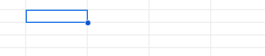

# Uvita

Uso una hoja de cálculo de Google para registrar los pagos de mi
crédito hipotecario UVA (Unidad de Valor Adquisitivo). Para
automatizar la consulta del valor UVA correspondiente al primer día
hábil después del 10 de cada mes, ensayé una solución utilizando [Apps
Script](https://developers.google.com/apps-script?hl=es-419). Esta
herramienta permite conectar una celda directamente con la [API de
Principales Variables del
BCRA](https://www.bcra.gob.ar/Catalogo/apis.asp?fileName=principales-variables-v2&sectionName=Estad%EDsticas).

## Ejemplos

### A mano
Para consultar el valor de la UVA del día mediante la API del BCRA, desde la terminal:
``` shell
URL="https://api.bcra.gob.ar/estadisticas/v2.0" # versión nueva
ENDPOINT="datosvariable" # principales variables
ID=31 # variable UVA
FECHA=$(date +%Y-%m-%d) # fecha actual

# Con el certificado
curl --cacert bcra-gob-ar.pem $URL/$ENDPOINT/$ID/$FECHA/$FECHA

# Habilitando conexiones inseguras (¡malo, muy malo!)
curl -k $URL/$ENDPOINT/$ID/$FECHA/$FECHA
```

### Con Apps Script
Las funciones auxiliares del archivo `uva.gs` se pueden llamar
directamente desde una celda como una fórmula:
```
# por fecha
=fetchUvaValue("2024-12-10")

# por primer día hábil a partir del 10
=fetchUvaValue(getFirstWorkingDayAfterTenth(12, 2024)
```



## Links relevantes

- https://github.com/Jaldekoa/BCRA-Wrapper/
