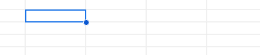

# Uvita

Herramienta para consultar automáticamente el valor de la UVA (Unidad de Valor Adquisitivo) en Google Sheets, diseñada para el seguimiento de créditos hipotecarios UVA.

Uso una hoja de cálculo de Google para registrar mes a mes la evolución de los pagos de mi crédito hipotecario UVA. Para automatizar la consulta del valor UVA correspondiente al primer día hábil después del 10 de cada mes, desarrollé esta solución utilizando [Apps Script](https://developers.google.com/apps-script?hl=es-419). Esta herramienta conecta directamente con la [API de Principales Variables del BCRA](https://www.bcra.gob.ar/Catalogo/apis.asp?fileName=principales-variables-v2&sectionName=Estad%EDsticas), permitiendo obtener valores históricos sin intervención manual.

## Instalación

1. Abrir tu hoja de cálculo de Google Sheets
2. Ir a **Extensiones → Apps Script**
3. Copiar todo el contenido del archivo [`uva.gs`](./uva.gs) en el editor
4. Guardar el proyecto (Ctrl+S o Cmd+S)
5. Cerrar el editor de Apps Script

Las funciones quedarán disponibles inmediatamente en tu hoja de cálculo.

## Uso

Las funciones se utilizan directamente en las celdas como fórmulas:

### Obtener valor UVA por fecha específica

```
=fetchUvaValue("2024-12-10")
```

### Obtener valor UVA del primer día hábil después del 10

```
=fetchUvaValue(getFirstWorkingDayAfterTenth(12, 2024))
```

Esta segunda opción es útil para cálculos mensuales automáticos, ya que las cuotas UVA se actualizan típicamente el primer día hábil después del día 10 de cada mes.

### Ejemplo en uso



## Funciones Disponibles

### `fetchUvaValue(date)`
Obtiene el valor UVA desde la API del BCRA para una fecha específica.

- **Parámetro**: `date` (string) - Fecha en formato YYYY-MM-DD
- **Retorna**: Valor numérico de la UVA o mensaje de error
- **Validaciones**: Formato de fecha, errores HTTP, estructura de respuesta

### `getFirstWorkingDayAfterTenth(month, year)`
Calcula el primer día hábil (lunes a viernes) en o después del día 10 del mes.

- **Parámetros**:
  - `month` (número) - Mes (1-12)
  - `year` (número) - Año completo (ej: 2024)
- **Retorna**: Fecha en formato YYYY-MM-DD o mensaje de error
- **Nota**: Solo considera fines de semana, no feriados nacionales

## Notas Técnicas

- Las funciones incluyen validación de parámetros de entrada
- Los errores se reportan de forma específica (formato incorrecto, HTTP, etc.)
- La conexión usa validación SSL estándar (segura)
- No se requiere autenticación para la API del BCRA
- La API del BCRA puede no tener datos disponibles para fechas muy recientes o futuras

## Desarrollo

### Probar la API manualmente

Para consultar el valor de la UVA directamente desde la terminal:

```bash
URL="https://api.bcra.gob.ar/estadisticas/v2.0"
ENDPOINT="datosvariable"
ID=31  # Variable UVA
FECHA=$(date +%Y-%m-%d)

curl "$URL/$ENDPOINT/$ID/$FECHA/$FECHA"
```

## Referencias

- [API Principales Variables del BCRA](https://www.bcra.gob.ar/Catalogo/apis.asp?fileName=principales-variables-v2&sectionName=Estad%EDsticas) - Documentación oficial
- [Google Apps Script](https://developers.google.com/apps-script?hl=es-419) - Plataforma de desarrollo
- [BCRA-Wrapper](https://github.com/Jaldekoa/BCRA-Wrapper/) - Librería alternativa en Node.js
